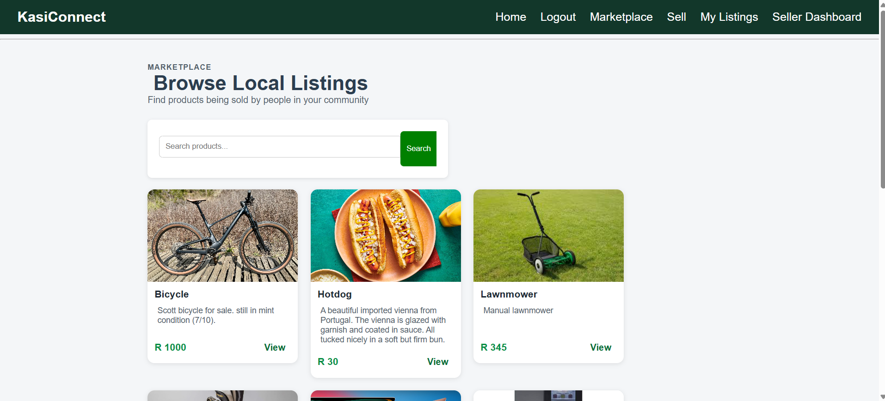
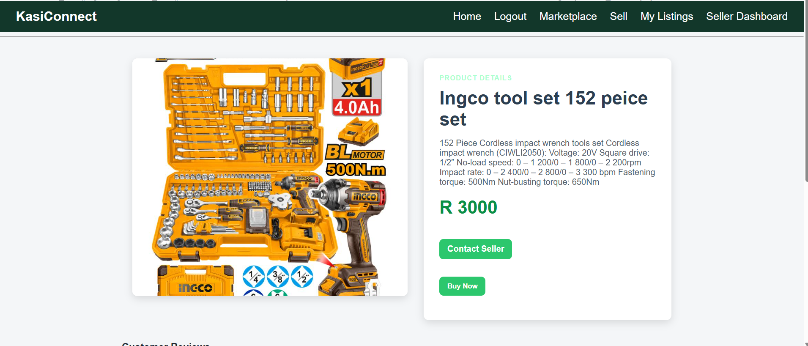
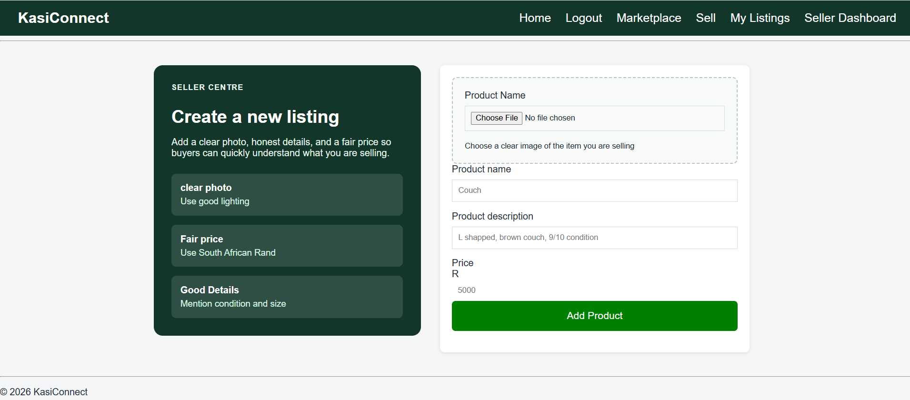
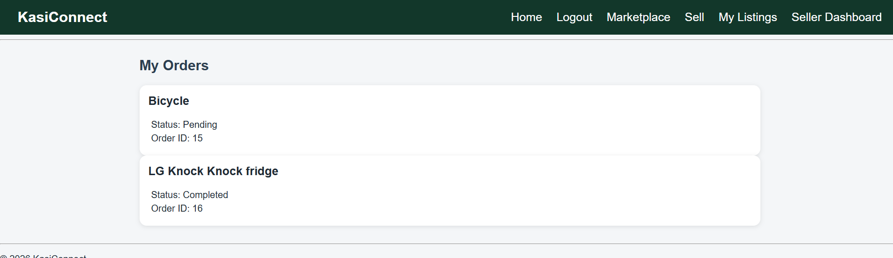
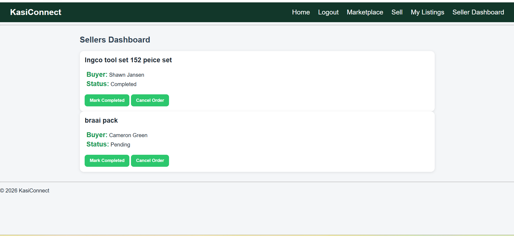
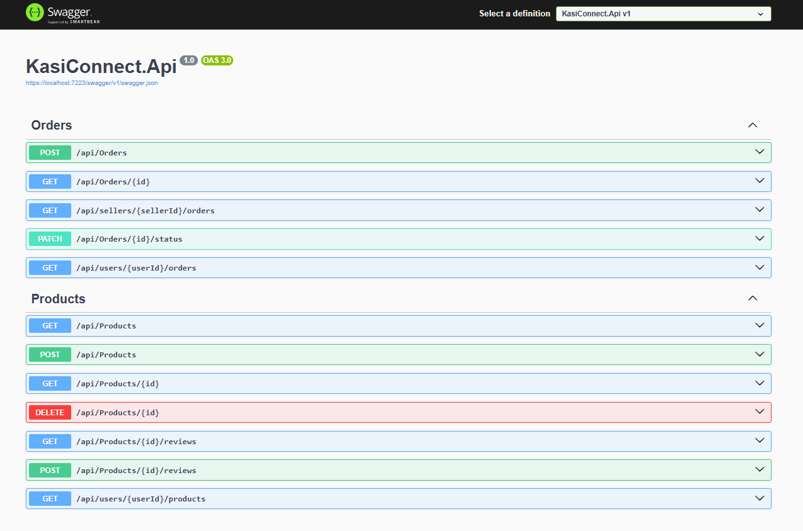

# KasiConnect

KasiConnect is a local marketplace web application where users can list products, browse items, leave reviews, place orders, and manage seller order statuses.

This project started as a PHP/XAMPP application and was modernized by adding an ASP.NET Core Web API backend that connects to the same MySQL database.

## Tech Stack

- PHP
- JavaScript
- HTML/CSS
- ASP.NET Core Web API
- Entity Framework Core
- MySQL / MariaDB
- XAMPP
- Swagger

## Features

- User login and registration
- Browse marketplace products
- Search products
- View product details
- Add product listings
- Delete own listings
- Submit product reviews
- View product reviews
- Place orders
- View buyer order history
- Seller dashboard
- Update order status

| Method | Endpoint | Description |
| --- | --- | --- |
| GET | `/api/products` | Get all products |
| GET | `/api/products?search=value` | Search products |
| GET | `/api/products/{id}` | Get one product |
| POST | `/api/products` | Create a product |
| DELETE | `/api/products/{id}` | Delete a product |
| GET | `/api/products/{id}/reviews` | Get product reviews |
| POST | `/api/products/{id}/reviews` | Create a review |
| POST | `/api/orders` | Create an order |
| GET | `/api/users/{userId}/orders` | Get buyer orders |
| GET | `/api/users/{userId}/products` | Get seller listings |
| GET | `/api/sellers/{sellerId}/orders` | Get seller orders |
| PATCH | `/api/orders/{id}/status` | Update order status |

## Project Structure
```text
KasiConnect
├── CSS
├── Images
├── Includes
├── JS
├── Pages
├── KasiConnect.Api
├── index.php
└── logout.php
```

## What I Learned
- Connected an ASP.NET Core API to an existing MySQL database
- Built REST endpoints using controllers and DTOs
- Used JAvaScript `fetch()` to connect php pages to a C# backend
- Gradually modernized an existing PHP project without restarting from scratch
- Practiced backend development, API design, and database integration

## Future Improvements
- Add JWT authentication to the ASP.NET Core API
- Move image upload fully into the C# API
- Add Docker support
- Deploy the API to Azure
- Add GitHub Actions for CI/CD
- Improve frontend validation and error handling 

## Running the Project Locally
1. Start Xampp.
    - Apache
    - MySQL
2. Import the Database
    - Open phpMyAdmin
    - create or import the kasi_connect database
    - a clean database schema is included at:
        database/kasi_connect_schema.sql 
3. Configure the PHP Database Connection
    - <?php
        $conn = new mysqli("localhost", "root", "", "kasi_connect");

            if ($conn->connect_error) 
            {
                die("Database connection failed: " . $conn->connect_error);
            }
        ?>
4. Run the ASP.NET Core API
    - open the terminal in KasiConnect.Api
    - run: dotnet run
    - The API should start on a localhost URL (https://localhost:7223)
5. Open the PHP Frontend
    - open: http://localhost/KasiConnect

## Screenshot

    ## Marketplace
    
    
    ## Product Details
    
    
    ## Add Products
    

    ## My orders
    

    ## Seller Dashboard
    

    ## Swagger API
    

    ## Docker

    The ASP.NET Core API incldues a DockerFile.
    Build the API image from the `KasiConnect.Api` folder:
        docker build -t kasiconnect-api .

##  CI/CD

This project includes a GitHub Actions workflow that builds the ASP.NET Core API on push and pull requests.

Workflow file:
    .github/workflows/api-build.yml